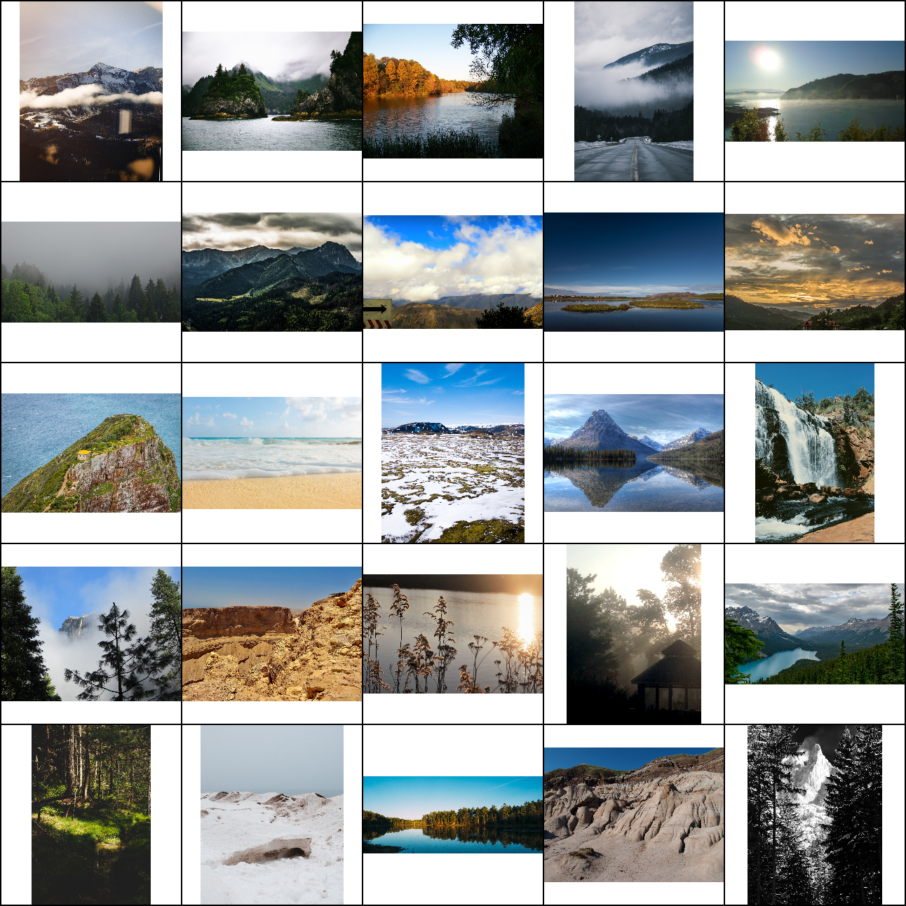

### About
This repo contains the official implementation of the [Aligning Latent and Image Spaces to Connect the Unconnectable](https://arxiv.org/abs/2104.06954) paper.
It is a GAN model which can generate infinite images of diverse and complex scenes.

<div style="text-align:center">

</div>

[[Project page]](http://universome.github.io/alis)
[[Paper]](https://arxiv.org/abs/2104.06954)

[](https://paperswithcode.com/sota/infinite-image-generation-on-lhq?p=aligning-latent-and-image-spaces-to-connect)


### Installation
To install, run the following command:
```
conda env create --file environment.yml --prefix ./env
conda activate ./env
```

Note: the tensorboard requirement is crucial, because otherwise upfirdn2d will not compile for some magical reason.
The repo should work both on Linux/MacOS and Windows machines.
However, on Windows, there might arise difficulties with installing some requirements: please see [#3](https://github.com/universome/alis/issues/3) to troubleshoot.
Also, since the current repo is heavily based on StyleGAN2-ADA, it might be helpful to check [the original installation requirements](https://github.com/NVlabs/stylegan2-ada-pytorch#requirements).


### Training
To train the model, navigate to the project directory and run:
```
python infra/launch_local.py hydra.run.dir=. +experiment_name=my_experiment_name +dataset=dataset_name num_gpus=4
```
where `dataset_name` is the name of the dataset without `.zip` extension inside `data/` directory (you can easily override the paths in `configs/main.yml`).
So make sure that `data/dataset_name.zip` exists and should be a plain directory of images.
See [StyleGAN2-ADA](https://github.com/NVlabs/stylegan2-ada-pytorch) repo for additional data format details.
This training command will create an experiment inside `experiments/` directory and will copy the project files into it.
This is needed to isolate the code which produces the model.


### Inference
The inference example can be found in [notebooks/generate.ipynb](notebooks/generate.ipynb)


### Data format
We use the same data format as the original [StyleGAN2-ADA](https://github.com/NVlabs/stylegan2-ada-pytorch) repo: it is a zip of images.
It is assumed that all data is located in a single directory, specified in `configs/main.yml`.
Put your datasets as zip archives into `data/` directory.
It is recommended to preprocess the dataset with the procedure described in Algorithm 1 since it noticeably affects the results (see Table 3).


### Pretrained checkpoints
We provide checkpoints for the following datasets:
- [LHQ 1024x1024](https://vision-cair.s3.amazonaws.com/alis/lhq1024-snapshot.pkl) with FID = 7.8. Note: this checkpoint has patch size of 1024x512, i.e. the image is generated in just 2 halves.


### LHQ dataset

**Note**: images are sorted by their likelihood. That's why images with smaller idx are much more noisy.
We will release a filtered version soon.

<div style="text-align:center">

</div>


We collected 90k high-resolution nature landscape images and provide them for download in the following formats:
| Path       | Size | Number of files | Format | Description |
| - |------|-----------------|--------|-------------|
| [Landscapes HQ](https://disk.yandex.ru/d/jyR2Y-w1p6otwg?w=1) | 283G | 90,000 | PNG | The root directory with all the files |
| &boxvr;&nbsp; [LHQ](https://disk.yandex.ru/d/gzI7AQlTVbvKQw?w=1) | 155G | 90,000 | PNG | The complete dataset. Split into 4 zip archives. |
| &boxvr;&nbsp; [LHQ1024](https://disk.yandex.ru/d/jUubeqkT0wbMRg?w=1) | 107G | 90,000 | PNG | LHQ images, resized to min-side=1024 and center-cropped to 1024x1024. Split into 3 zip archives. |
| &boxvr;&nbsp; [LHQ1024_jpg](https://disk.yandex.ru/d/Sz1gPiMoUregEQ) | 12G | 90,000 | JPG | LHQ1024 converted to JPG format with `quality=95` (with [Pillow](https://pillow.readthedocs.io/en/stable/))* |
| &boxvr;&nbsp; [LHQ256](https://disk.yandex.ru/d/HPEEntpLv8homg) | 8.7G | 90,000 | PNG | LHQ1024 resized to 256x256 with Lanczos interpolation |
| &boxur;&nbsp; [metadata.json](https://disk.yandex.ru/d/DOr5CP_QpZtGRQ) | 27M | 1 | JSON | Dataset metadata (author names, licenses, descriptions, etc.) |

*`quality=95` in Pillow for JPG images (the default one is `75`) provides images almost indistinguishable from PNG ones both visually and in terms of FID.

The images come with Unsplash/Creative Commons/U.S. Government Works licenses which allow distribution and use for research purposes.
For details, see [lhq.md](./lhq.md) and Section 4 in the paper.

Downloading files:
```
python download_lhq.py [DATASET_NAME]
```

### License
The project is based on the [StyleGAN2-ADA repo](https://github.com/NVlabs/stylegan2-ada-pytorch) developed by NVidia.
I am not a lawyer, but I suppose that [NVidia License](https://nvlabs.github.io/stylegan2-ada-pytorch/license.html) applies to the code of this project then.
But the LHQ dataset is released under the Creative Commons Attribution 2.0 Generic (CC BY 2.0) License, which allows to use it in any way you like. See [lhq.md](lhq.md).


### BibTeX
```
@article{ALIS,
  title={Aligning Latent and Image Spaces to Connect the Unconnectable},
  author={Skorokhodov, Ivan and Sotnikov, Grigorii and Elhoseiny, Mohamed},
  journal={arXiv preprint arXiv:2104.06954},
  year={2021}
}
```
