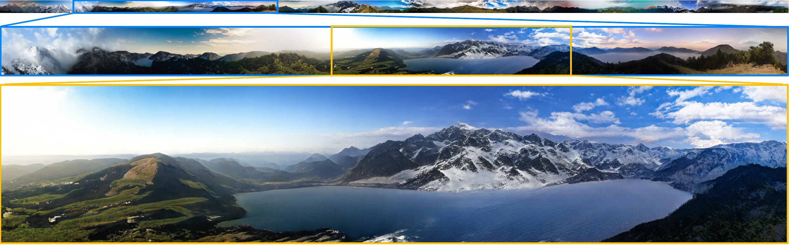

### About
This repo contains the official implementation of the [Aligning Latent and Image Spaces to Connect the Unconnectable](https://arxiv.org/abs/2104.06954) paper.
It is a GAN model which can generate infinite images of diverse and complex scenes.



[[Project page]](http://universome.github.io/alis)
[[Paper]](https://arxiv.org/abs/2104.06954)

### Installation
To install, run the following command:
```
conda env create --file environment.yml --prefix ./env
conda activate ./env
```

Note: the tensorboard requirement is crucial, because otherwise upfirdn2d will not compile for some magical reason.
The repo should work both on Linux/MacOS and Windows machines.
However, on Windows, there might arise difficulties with installing some requirements: please see [#3](https://github.com/universome/alis/issues/3) to troubleshoot.
Also, since the current repo is heavily based on StyleGAN2-ADA, it might be helpful to check [the original installation requirements](https://github.com/NVlabs/stylegan2-ada-pytorch#requirements).

### Training
To train the model, navigate to the project directory and run:
```
python infra/launch_local.py hydra.run.dir=. +experiment_name=my_experiment_name +dataset=dataset_name num_gpus=4
```
where `dataset_name` is the name of the dataset without `.zip` extension inside `data/` directory (you can easily override the paths in `configs/main.yml`).
So make sure that `data/dataset_name.zip` exists and should be a plain directory of images.
See [StyleGAN2-ADA](https://github.com/NVlabs/stylegan2-ada-pytorch) repo for additional data format details.
This training command will create an experiment inside `experiments/` directory and will copy the project files into it.
This is needed to isolate the code which produces the model.


### Inference
The inference example can be found in [notebooks/generate.ipynb](notebooks/generate.ipynb)

### Data format
We use the same data format as the original [StyleGAN2-ADA](https://github.com/NVlabs/stylegan2-ada-pytorch) repo: it is a zip of images.
It is assumed that all data is located in a single directory, specified in `configs/main.yml`.
Put your datasets as zip archives into `data/` directory.
It is recommended to preprocess the dataset with the procedure described in Algorithm 1 since it noticeably affects the results (see Table 3).

### Pretrained checkpoints
We provide checkpoints for the following datasets:
- [LHQ 1024x1024](https://vision-cair.s3.amazonaws.com/alis/lhq1024-snapshot.pkl) with FID = 7.8. Note: this checkpoint has patch size of 1024x512, i.e. the image is generated in just 2 halves.

### License
The project is based on the [StyleGAN2-ADA repo](https://github.com/NVlabs/stylegan2-ada-pytorch) developed by NVidia.
I am not a lawyer, but I suppose that [NVidia License](https://nvlabs.github.io/stylegan2-ada-pytorch/license.html) applies to this project then.

### BibTeX
```
@article{ALIS,
  title={Aligning Latent and Image Spaces to Connect the Unconnectable},
  author={Skorokhodov, Ivan and Sotnikov, Grigorii and Elhoseiny, Mohamed},
  journal={arXiv preprint arXiv:2104.06954},
  year={2021}
}
```
