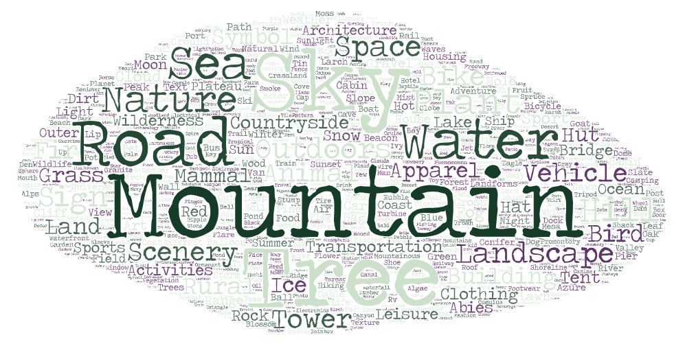

# Landscapes HQ dataset
We collected 90 000 high-resolution landscape images from [Unsplash](https://unsplash.com) (64,669 images) and [Flickr](https://www.flickr.com/) (25,331 images).

| Path       | Size | Number of files | Format | Description |
| - |------|-----------------|--------|-------------|
| [Landscapes HQ](https://disk.yandex.ru/d/jyR2Y-w1p6otwg?w=1) | 283G | 90,000 | PNG | The root directory with all the files |
| &boxvr;&nbsp; [LHQ](https://disk.yandex.ru/d/gzI7AQlTVbvKQw?w=1) | 155G | 90,000 | PNG | The complete dataset. Split into 4 zip archives. |
| &boxvr;&nbsp; [LHQ1024](https://disk.yandex.ru/d/jUubeqkT0wbMRg?w=1) | 107G | 90,000 | PNG | LHQ images, resized to min-side=1024 and center-cropped to 1024x1024. Split into 3 zip archives. |
| &boxvr;&nbsp; [LHQ1024_jpg](https://disk.yandex.ru/d/Sz1gPiMoUregEQ) | 12G | 90,000 | JPG | LHQ1024 converted to JPG format with `quality=95` (with [Pillow](https://pillow.readthedocs.io/en/stable/))* |
| &boxvr;&nbsp; [LHQ256](https://disk.yandex.ru/d/HPEEntpLv8homg) | 8.7G | 90,000 | PNG | LHQ1024 resized to 256x256 with Lanczos interpolation |
| &boxur;&nbsp; [metadata.json](https://disk.yandex.ru/d/DOr5CP_QpZtGRQ) | 27M | 1 | JSON | Dataset metadata (author names, licenses, descriptions, etc.) |

*`quality=95` in Pillow for JPG images (the default one is `75`) provides images almost indistinguishable from PNG ones both visually and in terms of FID.

<div style="text-align:center">

</div>

Downloading files:
```
python download_lhq.py [DATASET_NAME]
```

# License

https://creativecommons.org/publicdomain/zero/1.0/
http://www.usa.gov/copyright.shtml

The individual images from LHQ dataset have one of the following licenses:
- [Unsplash License](https://unsplash.com/license)
- [Creative Commons Attribution License](https://creativecommons.org/licenses/by/2.0/)
- [Creative Commons Attribution-NonCommercial License](https://creativecommons.org/licenses/by-nc/2.0/)
- [Creative Commons Public Domain Mark](https://creativecommons.org/publicdomain/mark/1.0/)
- [Creative Commons Public Domain Dedication (CC0)](https://creativecommons.org/publicdomain/zero/1.0/)
- [United States Government Work](http://www.usa.gov/copyright.shtml)

To see, which image has which license, please see the corresponding [metadata](https://disk.yandex.ru/d/DOr5CP_QpZtGRQ).

The dataset itself is published under Creative Commons Attribution 2.0 Generic (CC BY 2.0) License: https://creativecommons.org/licenses/by/2.0/.
This means, that you can use it however you like, but you should attribute the source (i.e. give a link to this repo or cite the paper).

# Dataset collection

<div style="text-align:center">

</div>

Images were obtained by downloading 450k images from Unsplash and Flickr using a set of 400 manually constructed search queries and preprocessing it with a pretrained Mask R-CNN to filter out images that likely contained objects and Inception V3 statistics to remove "too out-of-distribution" samples.
For more information, see Section 4 of the paper: https://arxiv.org/abs/2104.06954

# BibTeX
```
@article{ALIS,
  title={Aligning Latent and Image Spaces to Connect the Unconnectable},
  author={Skorokhodov, Ivan and Sotnikov, Grigorii and Elhoseiny, Mohamed},
  journal={arXiv preprint arXiv:2104.06954},
  year={2021}
}
```
